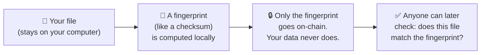
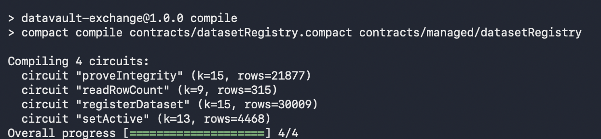
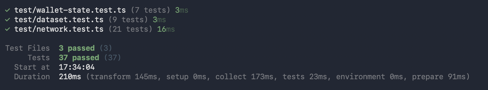
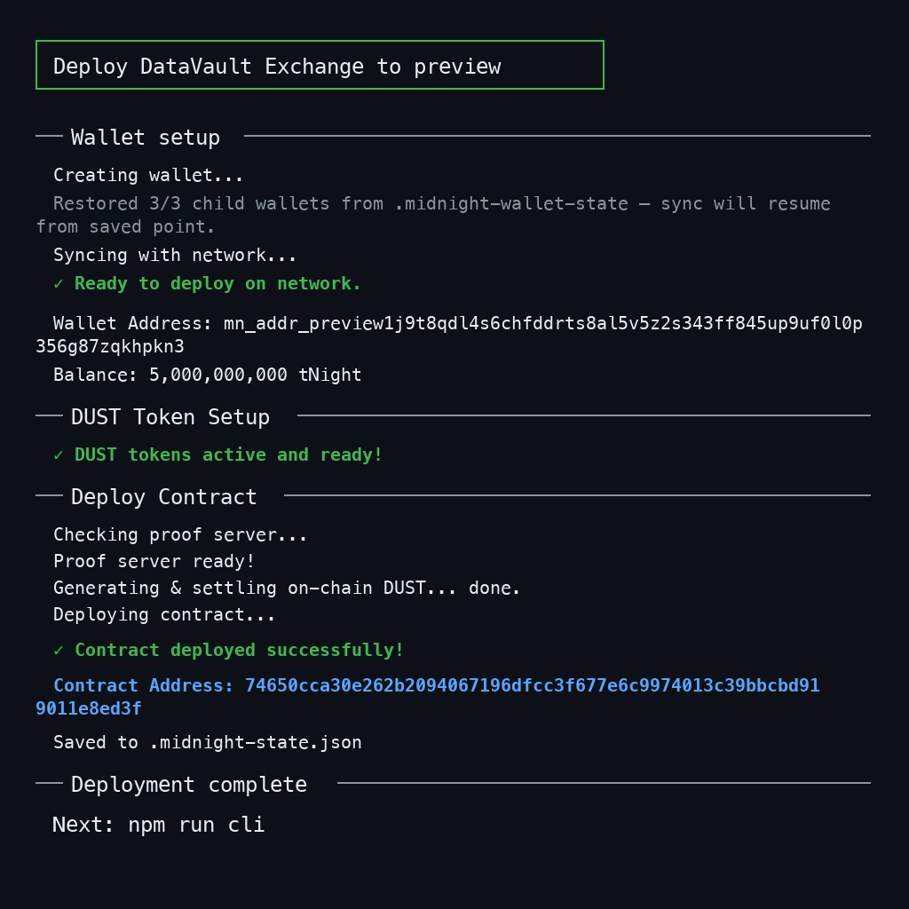

<div align="center">

# DataVault Exchange

### Prove your AI dataset is real — without showing anyone the data inside.

[](https://ai-dataset-dex.vercel.app/)
[](https://www.loom.com/share/06f0afedace648bf866668f6adc52aee)
[](https://github.com/MeghiyaT/AI-Dataset-DEX/actions/workflows/test.yml)
[](package.json)

</div>

---

## What is this?

DataVault Exchange is a **privacy-first marketplace for AI training datasets**.

Here's the problem it solves: if you own a valuable dataset — patient records, financial data, proprietary research — you can't just hand it to a buyer to inspect before they pay. And a buyer can't pay for data they can't verify is real.

DataVault breaks that deadlock. Using the **Midnight blockchain**, a data provider can mathematically *prove* their dataset is authentic and untampered — without ever revealing the records inside. The buyer gets certainty. The provider keeps their data private.

> **No cryptography knowledge required** to use this app. Just connect a wallet, upload your file, and the math happens automatically.

---

## 🚀 Try it live

| | |
|---|---|
| **Live App** | [ai-dataset-dex.vercel.app](https://ai-dataset-dex.vercel.app/) |
| **3-Minute Demo Video** | [Watch on Loom](https://www.loom.com/share/06f0afedace648bf866668f6adc52aee) |

---

## What you can do

- 📝 **Register a dataset** — list your AI dataset with a name, size, and license. A tamper-proof fingerprint of your file is recorded on the blockchain. Your actual data never leaves your computer.
- 🔍 **Verify a dataset** — as a buyer, request proof that a listed dataset is genuine. The provider's file is checked against the on-chain fingerprint. Pass = the data is real.
- 📊 **Browse the marketplace** — explore all publicly registered datasets, filter by license, and check how many times each one has been independently verified.

---

## How it works

Three steps, no jargon:



**The magic part:** when someone verifies your dataset, they're asking "does this file produce the exact same fingerprint as the one on-chain?" — and the answer is proven mathematically without you re-uploading anything. This is called a **zero-knowledge proof** (a way to prove you know something without revealing what that something is).

---

## What stays private vs what is public

| What stays on **YOUR computer** | What gets recorded on **the blockchain** |
|---|---|
| Your raw dataset (CSV, Parquet, images, etc.) | A 32-byte fingerprint of your data (like a checksum) |
| Your secret identity key | A hash of your identity (not the key itself) |
| The individual rows, records, or entries | Your dataset's name, size, license, and row count |
| Any personally identifiable information | A running count of successful verifications |

**Bottom line:** an observer looking at the blockchain can see *that* a dataset called "Medical Imaging 2024" exists with 1,000,000 rows under a CC-BY-4.0 license. They cannot see a single row of data inside it.

---

## Privacy model

### What a chain observer CAN learn about your dataset

✅ That a dataset with a given name was registered  
✅ The claimed file size (in bytes) and row count  
✅ The license type  
✅ The number of times the dataset has been verified  
✅ Whether it is currently listed as active  

### What they CANNOT learn

❌ Any row of your actual data  
❌ Your secret identity key  
❌ The content of the file at any point  
❌ Which buyer verified which dataset — verification proofs carry no buyer identity  

The raw data is processed entirely on your own machine inside a local proof-generation program (the "proof server"). It is never transmitted over the network — not to us, not to the blockchain, not to anyone.

---

## Run it locally

### What you need first

- **Node.js** version 22 or higher — [nodejs.org](https://nodejs.org)
- **Docker Desktop** — [docker.com/products/docker-desktop](https://www.docker.com/products/docker-desktop) (runs the local proof server)
- **Compact compiler** — follow the [Midnight installation guide](https://docs.midnight.network/getting-started/installation)
- A **Midnight wallet** (Lace or 1AM browser extension) if you want to run real transactions on testnet

---

### Step-by-step setup

**1. Clone the repository**
```bash
git clone https://github.com/MeghiyaT/AI-Dataset-DEX.git
cd AI-Dataset-DEX
```

**2. Install dependencies**
```bash
npm install
cd frontend && npm install && cd ..
```

**3. Start the proof server** (runs in the background via Docker)
```bash
docker compose up -d proof-server
```

**4. Compile the smart contract**
```bash
npm run compile
```

You should see output listing all 4 compiled circuits:



**5. Run the test suite**
```bash
npm test
```

Expected output:
```
 ✓ test/dataset.test.ts (9 tests)
 ✓ test/wallet-state.test.ts (7 tests)
 ✓ test/network.test.ts (21 tests)

 Test Files  3 passed (3)
      Tests  37 passed (37)
   Duration  ~174ms
```



**6. Deploy the contract** *(optional — connects to Midnight Preview testnet)*

First, fund your wallet from the [Preview faucet](https://midnight-tmnight-preview.nethermind.dev), then:

```bash
npm run setup -- --network preview
```

**7. Start the frontend**
```bash
npm run frontend:dev
```

Open [http://localhost:5173](http://localhost:5173) in your browser.

---

### Frontend environment setup

Copy the example file and fill in your contract address:
```bash
cp frontend/.env.example frontend/.env.local
```

```env
VITE_NETWORK=preprod
VITE_CONTRACT_ADDRESS=7def714414d5008a6567f0a8cff655b40e3fe0c08260f7fc1dc2ab139612fe45
VITE_INDEXER_URL=https://indexer.preprod.midnight.network/api/v4/graphql
VITE_INDEXER_WS_URL=wss://indexer.preprod.midnight.network/api/v4/graphql/ws
```

---

## Deployed contracts

| Network | Status | Contract Address | Explorer Link | Notes |
|---|---|---|---|---|
| **Preview** (testnet) | **Active (Latest)** | `74650cca30e262b2094067196dfcc3f677e6c9974013c39bbcbd919011e8ed3f` | [Preview Explorer](https://explorer.preview.midnight.network/) | Multi-user open provider commitment + on-chain category architecture |
| **Preprod** (testnet) | *Legacy / Outdated* | `7def714414d5008a6567f0a8cff655b40e3fe0c08260f7fc1dc2ab139612fe45` | [Preprod Explorer](https://explorer.preprod.midnight.network/) | Preserved for historical auditability and reference to early transaction records |

> [!NOTE]
> **Why the Legacy Preprod Address is Kept**:
> Due to synchronization bottlenecks and sync issues with the Midnight Preprod network (where historical note scanning across 2M+ blocks caused extended sync delays), the active deployment was migrated to Midnight Preview (`74650cca30e262b2094067196dfcc3f677e6c9974013c39bbcbd919011e8ed3f`). The legacy Preprod address (`7def714414d5008a6567f0a8cff655b40e3fe0c08260f7fc1dc2ab139612fe45`) is retained for historical auditability and reference to earlier testnet transactions.



**Verify contract state via Preview Indexer GraphQL:**
```bash
curl -X POST https://indexer.preview.midnight.network/api/v4/graphql \
  -H "Content-Type: application/json" \
  -d '{"query": "{ contractAction(address: \"74650cca30e262b2094067196dfcc3f677e6c9974013c39bbcbd919011e8ed3f\") { address } }"}'
```

---

## CLI reference

Once deployed, you can interact with the contract from your terminal:

```bash
# List all registered datasets
npm run cli -- list

# Register a dataset from a local file
npm run cli -- register my-dataset "Medical Images v1" 524288000 "1000000" CC-BY-4.0 --file ./data.csv

# Prove a dataset's integrity (generates a proof locally)
npm run cli -- prove my-dataset --file ./data.csv

# Toggle a listing's visibility
npm run cli -- set-active my-dataset on

# Query a dataset's row count (public, no wallet needed)
npm run cli -- row-count my-dataset
```

---

## The smart contract

The contract (`contracts/datasetRegistry.compact`) defines exactly **4 actions**:

| Action | Who can call it | What it does |
|---|---|---|
| `registerDataset` | Owner only | Stores a fingerprint of your dataset + public listing metadata |
| `proveIntegrity` | Anyone | Proves in zero-knowledge that a file matches the on-chain fingerprint |
| `setActive` | Owner only | Shows or hides a listing in the marketplace |
| `readRowCount` | Anyone | Returns the publicly registered row count for a dataset |

The contract is written in **Compact** — Midnight's privacy-first smart contract language. It is compiled to a zero-knowledge circuit, which means the math is verified by the blockchain without any private data being revealed.

---

## Tech stack

| Layer | Technology |
|---|---|
| Smart contract language | Compact (Midnight's ZK contract language) |
| Zero-knowledge proof engine | Midnight Proof Server (runs locally via Docker) |
| Blockchain network | Midnight Network |
| Backend / CLI | TypeScript + Node.js ≥ 22 |
| Frontend | React 18 + Vite + TypeScript |
| Wallet support | Midnight Lace, 1AM |
| Testing | Vitest (37 tests) |
| Hosting | Vercel |

---

## CI / CD

Every push to `main` and every pull request automatically runs the full test suite and frontend build via GitHub Actions.

[](https://github.com/MeghiyaT/AI-Dataset-DEX/actions/workflows/test.yml)

Workflow file: [`.github/workflows/test.yml`](.github/workflows/test.yml)

---

## Security

- **Wallet seed phrases and keys** are stored locally in `.midnight-state.json` (gitignored, readable only by you)
- **Raw dataset files** are never transmitted — they are processed in memory on your local machine only
- **The proof server** runs locally in Docker; private data is passed to it briefly to generate the proof, then immediately discarded
- All sensitive state files are excluded from git by `.gitignore`

---

## License

MIT — see [package.json](package.json)
