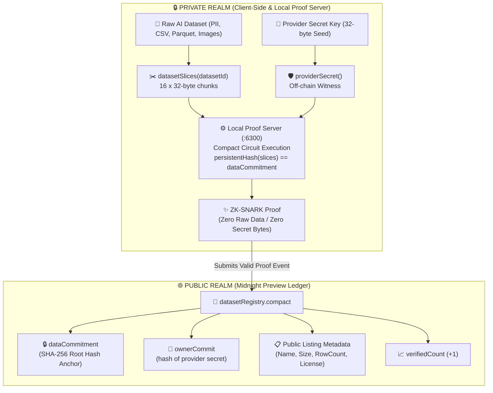

<div align="center">

# 🌐 DataVault Exchange
### Privacy-Preserving, Zero-Knowledge AI Dataset Marketplace on Midnight Network

[](https://ai-dataset-dex.vercel.app/)
[](https://www.loom.com/share/06f0afedace648bf866668f6adc52aee)
[](https://midnight.network)
[](https://vitest.dev)
[](https://docs.midnight.network)
[](package.json)

<br/>

**Verify AI training dataset integrity and ownership in zero-knowledge — without exposing a single row of raw data on-chain.**  
*Engineered for strict GDPR (Articles 5, 6, 9) and CCPA/CPRA data residency compliance.*

[🚀 Explore Live DApp](https://ai-dataset-dex.vercel.app/) • [🎥 Watch Video Demo](https://www.loom.com/share/06f0afedace648bf866668f6adc52aee) • [📜 Verified Contract](#-on-chain-verifiable-deployment-preview-network) • [🛡️ Privacy Architecture](#-the-privacy-claim--zero-knowledge-architecture)

---

</div>

## 📌 Verified Deliverables & Quick Links

> [!IMPORTANT]
> ### 🔗 Quick Verification References
> | Deliverable | Details & Links |
> |---|---|
> | 🚀 **Live DApp URL** | **[https://ai-dataset-dex.vercel.app/](https://ai-dataset-dex.vercel.app/)** *(Deployed on Vercel Edge)* |
> | 🎥 **Loom Demo Video** | **[Watch 3-Min Walkthrough on Loom](https://www.loom.com/share/06f0afedace648bf866668f6adc52aee)** *(Lace Wallet + ZK Circuit Call)* |
> | 📜 **Preview Contract Address** | `9d8bb1b1ede579d5c47c5fafdf7d81f8549a3db14b4c6cdee034c3e7697f7592` |
> | 👤 **Deployer Address** | `mn_addr_preview1j9t8qdl4s6chfddrts8al5v5z2s343ff845up9uf0l0p356g87zqkhpkn3` |
> | 🔍 **Midnight Indexer (GraphQL)** | `https://indexer.preview.midnight.network/api/v4/graphql` |
> | 🧪 **Automated Test Suite** | **37 / 37 passing tests** (`npm test` via Vitest) |

---

## 🎥 Demo Video Walkthrough

[](https://www.loom.com/share/06f0afedace648bf866668f6adc52aee)

> **Direct Link:** [https://www.loom.com/share/06f0afedace648bf866668f6adc52aee](https://www.loom.com/share/06f0afedace648bf866668f6adc52aee)

The video walkthrough demonstrates the complete cryptographic lifecycle on the **Midnight Preview Network**:

1. **Lace DApp Connection**: Connecting the official Midnight Lace browser wallet and retrieving unshielded tNIGHT / DUST balances.
2. **Live GraphQL Indexer Feed**: Real-time polling and decoding of active dataset listings from Midnight Preview ledger state.
3. **Client-Side Slicing & Hashing**: Partitioning raw dataset files into 16 chunks ($16 \times 32\text{ bytes}$) and computing SHA-256 cryptographic commitments in-browser.
4. **Zero-Knowledge Circuit Execution (`proveIntegrity`)**: Generating a ZK-SNARK proof locally via the proof-server and submitting the proof to the network.
5. **Verifiable State Transition**: On-chain verification and real-time incrementing of the public `verifiedCount` without leaking private training data.

---

## 🛡️ The Privacy Claim & Zero-Knowledge Architecture

### 1. The Fundamental Dilemma in AI Data Markets

High-value AI training data (clinical trials, medical imaging, proprietary LLM corpora, financial records, user telemetry) contains sensitive personal data governed by strict privacy legislation (**GDPR Art. 5/6/9**, **CCPA/CPRA**, and **HIPAA**).

* **The Sharing Dilemma**: Data providers cannot share raw datasets with prospective buyers prior to escrow settlement without risking copyright theft and massive compliance penalties.
* **The Trust Dilemma**: Buyers cannot buy blind datasets without mathematical proof that the provider genuinely holds authentic data matching the claimed specifications.
* **The DataVault Solution**: Midnight's dual-state architecture enables cryptographic commitments on-chain while keeping **100% of raw dataset records in off-chain zero-knowledge witnesses**.

---

### 2. Dual-State Architecture Diagram



---

### 3. Public State vs. Private Witness Matrix

Midnight enforces an absolute cryptographic boundary between what is public on-chain and what stays private off-chain:

| Dimension | Data Element | Classification | Location | Privacy & Exposure Guarantee |
|---|---|---|---|---|
| **Raw Content** | Training Data / CSV / Records | **Private Witness** | Local device memory | **0 bytes on-chain**. Never touches mempool, ledger, or indexer. |
| **Provider Key** | 32-byte Secret Key | **Private Witness** | Local wallet keystore | **Never revealed**. Only its hash `ownerCommit` is public. |
| **Integrity Anchor** | `dataCommitment` | **Public Ledger** | Midnight State (`DataListing`) | 32-byte SHA-256 root hash of the 16 dataset slices. |
| **Listing Info** | Name, Size, Rows, License | **Public Ledger** | Midnight State (`DataListing`) | Publicly discoverable for search and marketplace filtering. |
| **Integrity Score** | `verifiedCount` | **Public Ledger** | Midnight State (`Counter`) | Public counter incremented on every valid ZK-SNARK proof. |
| **Market Status** | `isActive` | **Public Ledger** | Midnight State (`DataListing`) | Public visibility toggle verified via owner ZK check. |

---

### 4. How Zero-Knowledge Verification Operates

When an actor executes `proveIntegrity(datasetId)`:

1. **Local Witness Invocation**: The client fetches the private dataset slices ($16 \times 32\text{ bytes}$) from local storage into the witness function `datasetSlices(datasetId)`.
2. **Off-Chain Circuit Evaluation**: The local proof server evaluates the Compact circuit:
   $$\text{anchor} = \text{persistentHash}(\text{datasetSlices})$$
   $$\text{assert}(\text{anchor} == \text{registry}[\text{datasetId}].\text{dataCommitment})$$
3. **ZK-SNARK Proof Generation**: The proof server outputs a cryptographic proof stating:
   > *"I possess the private dataset slices whose SHA-256 hash matches the on-chain anchor, without revealing the underlying data."*
4. **On-Chain State Transition**: Midnight consensus validators verify the proof. If valid, the ledger atomically increments `verifiedCount`.
5. **Immediate Memory Purge**: The raw witness slices are discarded immediately after proof evaluation.

---

## 🔍 On-Chain Verifiable Deployment (Preview Network)

The smart contract is live and fully verifiable on the **Midnight Preview Network**:

```yaml
Network: Midnight Preview
Contract Address: 9d8bb1b1ede579d5c47c5fafdf7d81f8549a3db14b4c6cdee034c3e7697f7592
Deployer Address: mn_addr_preview1j9t8qdl4s6chfddrts8al5v5z2s343ff845up9uf0l0p356g87zqkhpkn3
Indexer Endpoint: https://indexer.preview.midnight.network/api/v4/graphql
WebSocket Endpoint: wss://indexer.preview.midnight.network/api/v4/graphql/ws
```

### Verifying State via GraphQL

Query the contract directly from the public Midnight Preview Indexer:

```bash
curl -X POST https://indexer.preview.midnight.network/api/v4/graphql \
  -H "Content-Type: application/json" \
  -d '{"query": "{ contract(address: \"9d8bb1b1ede579d5c47c5fafdf7d81f8549a3db14b4c6cdee034c3e7697f7592\") { address state } }"}'
```

### Verifying State via CLI

```bash
# Query active listings from the deployed Preview contract
npm run cli -- --network preview list

# Verify public row count and dataset existence
npm run cli -- --network preview row-count med-v1
```

---

## ⚡ Smart Contract Circuits (`contracts/datasetRegistry.compact`)

The Compact smart contract implements **4 provable ZK circuits**:

```typescript
// contracts/datasetRegistry.compact

struct DataListing {
  providerCommit: Bytes<32>;    // Hash of provider secret key
  dataCommitment: Bytes<32>;    // Public integrity anchor: hash(slices)
  datasetName: Opaque<"string">;// Human-readable dataset name
  datasetSize: Uint<64>;        // Byte size of dataset
  rowCount: Opaque<"string">;   // Claimed row count (e.g. "1,000,000")
  license: Opaque<"string">;    // License type (e.g. "CC-BY-4.0")
  isActive: Boolean;            // Marketplace visibility toggle
};

export ledger registry: Map<Bytes<32>, DataListing>;
export ledger ownerCommit: Bytes<32>;
export ledger verifiedCount: Counter;
```

| Circuit | Access / Mode | Description |
|---|---|---|
| `registerDataset` | Owner ZK Check | Computes SHA-256 commitment of private dataset slices and registers public listing metadata. |
| `proveIntegrity` | Public ZK Circuit | Proves in zero-knowledge that the caller holds the matching dataset slices; increments `verifiedCount`. |
| `setActive` | Owner ZK Check | Toggles dataset visibility (`isActive`) with ZK proof of owner secret key. |
| `readRowCount` | Pure Public Query | Queries and returns the registered row count for an existing dataset ID. |

---

## 🛠️ Local Development & Setup

### Prerequisites

* **Node.js** `≥ 22.0.0`
* **npm** `≥ 10.0.0`
* **Docker & Docker Desktop** (for proof-server container)
* **Compact Compiler** (`compact --version` — [Midnight Docs](https://docs.midnight.network))

---

### Step-by-Step Installation

```bash
# 1. Clone the repository
git clone https://github.com/MeghiyaT/AI-Dataset-DEX.git
cd AI-Dataset-DEX

# 2. Install root and frontend dependencies
npm install
cd frontend && npm install && cd ..

# 3. Start the Midnight Proof Server (:6300)
docker compose up -d proof-server

# 4. Compile Compact Smart Contracts
npm run compile

# 5. Run Automated Test Suite (37 passing tests)
npm test

# 6. (Optional) Run Full-Stack Automated Setup on Preview
npm run setup -- --network preview

# 7. Start the Frontend DApp
npm run frontend:dev
```

Open [http://localhost:5173](http://localhost:5173) to interact with the local frontend.

---

## 🧪 Test Suite Coverage

```
 RUN  v3.2.7 /Users/meghiyatulse/Study/Midnight/AI Dataset DEX

 ✓ test/dataset.test.ts (9 tests)
 ✓ test/wallet-state.test.ts (7 tests)
 ✓ test/network.test.ts (21 tests)

 Test Files  3 passed (3)
      Tests  37 passed (37)
   Start at  23:03:22
   Duration  174ms
```

---

## 🧰 Technology Stack

| Layer | Component | Version / Spec |
|---|---|---|
| **Zero-Knowledge Smart Contracts** | Compact Language | `0.23+` |
| **Proof Generation Engine** | Midnight Proof Server | `8.1.0` (Docker `:6300`) |
| **Contract SDK** | Midnight JS Contracts | `4.1.1` |
| **Wallet & DUST Management** | Midnight Wallet SDK | `1.2.0` |
| **Key Derivation** | `@scure/bip39` | `2.2.0` (24-word BIP-39 mnemonic) |
| **On-Chain Indexer** | Midnight Indexer GraphQL | `4.3.3` |
| **Frontend Framework** | React 18 + Vite 5 + TypeScript | Tailored Glassmorphism Design |
| **Testing Framework** | Vitest | `3.2.7` (37 unit & integration tests) |
| **Cloud Hosting** | Vercel Edge Platform | Production DApp deployment |

---

## 🔒 Security & Compliance Best Practices

1. **Witness Privacy Guarantee**: Private witnesses (`providerSecret` and `datasetSlices`) are computed strictly inside client memory and the local proof server container. They are never serialized or transmitted over network endpoints.
2. **Disclose Boundary**: The Compact `disclose()` operator is applied exclusively to non-sensitive listing metadata and cryptographic hashes. Raw data never enters a `disclose()` block.
3. **State File Protection**: Local wallet credentials and seeds in `.midnight-state.json` and `.midnight-wallet-state/` are gitignored and restricted to owner-only read/write (`0o600`).

---

## 📜 License

This project is licensed under the [MIT License](package.json).
